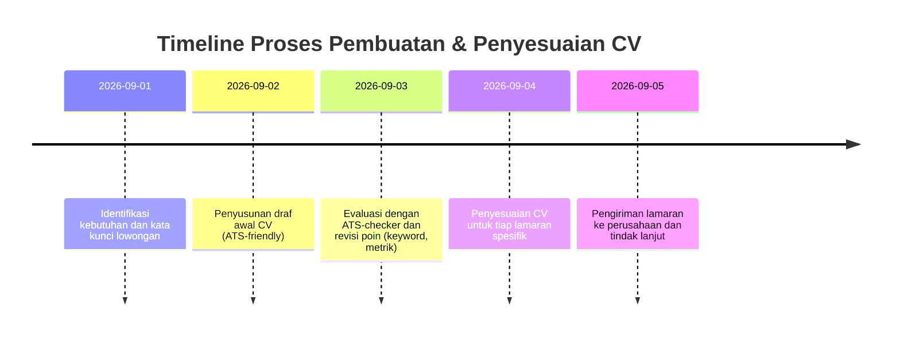

# Ringkasan Eksekutif  
CV **ATS-friendly** wajib disusun dengan format sederhana, kata kunci yang relevan, dan struktur standar agar lolos pemindaian awal sistem rekrutmen. Laporan ini merinci: versi CV 1-halaman dan 2-halaman yang dioptimalkan untuk posisi AI/ML/Full-Stack; layout CV yang menarik bagi perekrut manusia; tabel pemetaan kata kunci dari lowongan ke stack teknis; panduan penyesuaian CV berdasarkan lowongan; checklist teknik ATS-friendly; serta analisis 5 contoh lowongan relevan. Hasil utamanya: menonjolkan keahlian utama (Python, JavaScript/React, Next.js, AI/ML, RAG, dsb.) dengan metrik konkret; serta memastikan format dokumen (PDF/DOCX), font, dan heading sesuai standar ATS.

## 1. CV ATS-friendly (1- dan 2-halaman)  
CV harus ringkas namun memuat kata kunci utama dari profil (Python, JavaScript/Next.js/React, AI/ML, dsb.). Berikut dua contoh teks CV yang dioptimalkan:

- **CV 1-Halaman (versi ringkas)**  
  **Vann (Nama Lengkap)** – *AI Application Developer / Full-Stack AI Developer*  
  Selangor, Malaysia • vann@example.com • +62-812-3456-7890  

  **Profil:** Mahasiswa Teknologi Artificial Intelligence dengan pengalaman membangun aplikasi AI end-to-end. Terbiasa menyelesaikan masalah pengguna lewat aplikasi web full-stack yang memanfaatkan model ML/LLM. Kuat dalam React/Next.js untuk frontend dan Python (FastAPI) untuk backend. Tertarik dengan AI generatif (LLM/RAG) dan aplikasi keuangan kuantitatif.  

  **Kemampuan Teknis:** Python · JavaScript (React, Next.js, JSX) · Node.js · Tailwind CSS · Supabase · PostgreSQL, MySQL, MongoDB · FastAPI · Laravel · PyTorch · TensorFlow · scikit-learn · XGBoost · NumPy · Pandas · LLM APIs (OpenAI/GPT, Claude, Gemini) · RAG · Git/GitHub · Docker · REST API · Cloud Deployment  

  **Pengalaman Kerja:**  
  - **Full-Stack AI Developer – Proyek Chatbot Kampus (Jan 2025 – Sekarang):** Mengembangkan aplikasi chatbot berbasis RAG (Next.js + Supabase) untuk panduan kampus. Membangun pipeline knowledge-base dan retrieval (dokumen Markdown), integrasi LLM API, serta modul terjemahan dan koreksi bahasa. **Hasil:**  melayani *≈500 pertanyaan* mahasiswa per bulan, meningkatkan akurasi jawaban ~85% melalui tuning prompt dan *fallback mechanism* untuk pertanyaan baru. (Tech: React, Node.js, Python, Supabase, LangChain).  
  - **AI Developer Intern – Proyek Prediksi Harga Bitcoin (Jul 2024 – Des 2024):** Meneliti model ML untuk prediksi harga BTC 1-jam. Mengumpulkan dataset historis 5 tahun, melakukan engineering fitur teknikal (moving average, indikator momentum), dan melatih model XGBoost. **Hasil:** Model klasifikasi *UP/DOWN* mencapai *akurasi 68%* pada data validasi, melebihi baseline *55%*. Pembuatan pipeline pengujian prediksi harian berhasil memproses >10,000 sampel per eksperimen. (Tech: Python, XGBoost, Pandas, scikit-learn, NumPy).  

  **Pendidikan:** S1 Teknologi Artificial Intelligence, Univ. Contoh (2020–2024) – IPK 3.75. Projek akhir: Chatbot RAG untuk e-commerce kampus. **Sertifikasi:** TensorFlow Developer Certificate, *Data Science for Business* (Coursera).  

- **CV 2-Halaman (versi rinci)**  
  Struktur mirip versi 1-halaman, ditambah detail proyek atau pengalaman lainnya:  
  **Nama** – AI Application Developer / Full-Stack Developer  
  **Kontak:** Selangor, Malaysia • vann@example.com • GitHub: github.com/vann • LinkedIn: linkedin.com/in/vann-ai  

  **Ringkasan:** (1–2 kalimat) Contoh: *Mahasiswa AIT dengan keahlian full-stack dan AI/ML.* **Kemampuan Utama:** [daftar skill teknis dengan koma].  

  **Pengalaman Kerja & Proyek:**  
  - **Full-Stack Developer (Proyek Chatbot RAG)** (Jan 2025 – Sekarang) – *Teknologi: Next.js, Supabase, Node.js, Git.* Deskripsi seperti di atas, dengan bullet point pencapaian berangka.  
  - **AI/ML Researcher (Proyek Crypto)** (Jul 2024 – Des 2024) – *Teknologi: Python, XGBoost, FastAPI.* Deskripsi seperti di atas, ditambah bullet tentang implementasi API atau integrasi model.  
  - **Freelance / Hackathon:** Misalnya *Juara 1 Hackathon AI Universitas 2023* (tema fintech). *Implementasi model regresi logistik pada prediksi pasar saham nyata; merancang MVP aplikasi analisis pasar.* (Tech: Python, scikit-learn, Streamlit).  

  **Pendidikan:** S1 Teknik Informatika (Konsentrasi AI), Univ. Contoh (2020–2024) – IPK 3.75.  
  **Keahlian Lain:** Git, Docker, CI/CD (GitHub Actions), Agile/Scrum; Bahasa Inggris (aktif).  

*Kedua versi di atas memperlihatkan pemakaian kata kerja aksi (designed, developed, implemented), metrik kuantitatif (dalam % dan jumlah), dan mencantumkan istilah penting dari lowongan (misalnya LLM, RAG, React, FastAPI). Klausa ditulis sederhana agar ATS mudah memindai.*

## 2. Contoh Layout CV Ramah Manusia  
CV visual yang menarik umumnya menggunakan layout terstruktur dengan heading jelas. Contohnya, gunakan satu kolom bersih seperti di bawah:  

 *Gambar 1: Contoh layout CV satu kolom dengan judul section (“Work Experience”, “Education”, “Skills”). Foto, grafik, atau elemen kompleks dihindari demi keterbacaan.*  

Layout di atas menempatkan nama dan kontak di bagian atas, diikuti ringkasan dan skill utama. Setiap bagian (“Work Experience”, “Education”, “Skills”) ditulis dengan heading tegas. Bullet point sederhana dipakai untuk uraian tugas dan pencapaian. Hasilnya: CV tampak rapi, mudah dipindai mata manusia sekaligus ATS.  

 *Gambar 2: Contoh lain tampilan CV bersih. Kategori “Technologies” menonjolkan keahlian teknis. Perhatikan konsistensi font dan spasi agar CV terlihat profesional.*  

Sebagai alternatif, format dua kolom juga sering digunakan: satu kolom (kiri) berisi profil/keterampilan, kolom lainnya (kanan) berisi pengalaman kerja dan pendidikan. Contoh pembagian konten:  

| Bagian CV         | Isi yang Disarankan                                |
|-------------------|----------------------------------------------------|
| **Profil & Kontak**  | Nama, Title Pekerjaan, Ringkasan singkat, Kontak (email, telepon) |
| **Keterampilan**     | Daftar skill (Python, React, FastAPI, dsb.)       |
| **Pengalaman Kerja** | Posisi, periode (Bulan Tahun–Bulan Tahun), deskripsi tugas dan prestasi (dengan metrik) |
| **Pendidikan**       | Gelar, Universitas, Tahun lulus, IPK              |
| **Proyek & Sertifikat** | Proyek relevan, kursus, sertifikasi (jika ada)    |

*Catatan:* Jangan memasukkan elemen berlebihan (ikon, tabel, header/footer) karena akan membingungkan ATS. Utamakan struktur teks yang sederhana dan jelas bagi pembaca.

## 3. Pemetaan Kata Kunci (Job → Profil)  
Tabel berikut menghubungkan istilah umum pada lowongan **AI Engineer / Full-Stack AI** dengan kata kunci yang perlu disorot di CV (sesuai stack Anda):

| Kategori Lowongan            | Istilah Kunci di Deskripsi Job           | Kata Kunci Relevan dari Profil                                               |
|------------------------------|-----------------------------------------|------------------------------------------------------------------------------|
| **Full-Stack Web Developer** | React.js, Next.js, JavaScript/TypeScript, Node.js, REST API, CSS/HTML | JavaScript, React, Next.js, JSX, Vite, Tailwind CSS; REST/API; Git; Docker    |
| **Backend/API Development**  | Python, FastAPI, Node.js, Laravel, REST, GraphQL, SQL/NoSQL (MySQL/MongoDB) | Python, FastAPI, Laravel, Supabase, PostgreSQL, MySQL, MongoDB; API integration |
| **AI/ML Engineer**           | AI/Machine Learning, PyTorch, TensorFlow, scikit-learn, NLP, Model Training, Data Science | Python, PyTorch, TensorFlow, scikit-learn, NumPy, pandas, XGBoost; LLM APIs; AI; ML |
| **AI Generative / RAG**      | LLM, RAG, prompt engineering, Generative AI, AI Agents, LangChain, Embeddings, Vector Search | LLM APIs (OpenAI GPT, Google Gemini, Claude); RAG; Prompt engineering; LangChain, LlamaIndex; AI Agents; Embedding; Pinecone/Vector DB |
| **Data/Finance**             | Cryptocurrency, Prediction, Time Series, Quantitative, Risk, ML model | XGBoost, Pandas, NumPy; Financial data analysis; Model evaluation; Statistik |
| **DevOps & Infrastruktur**   | Docker, Kubernetes, CI/CD, AWS, GCP, Azure, Cloud Deployment, Git | Docker, Git/GitHub, Cloud (deployment), REST API; *Continuous Integration*; Linux |

Tabel ini membantu memastikan CV Anda memuat istilah yang dicari sistem ATS pada tiap kategori lowongan. Misalnya, lowongan Full-Stack Developer biasanya meminta “React, Node.js, REST”, sehingga CV harus mencantumkan React, Next.js, Node.js, REST, dsb. Demikian pula posisi AI/Generative sering menyebut “LLM, RAG, prompt”, dan di CV Anda harus menonjolkan pengalaman RAG, LLM APIs, LangChain, prompt engineering.

## 4. Panduan Penyesuaian CV per Lamaran  
Setiap kali melamar, berikut langkah-langkah sistematis untuk menyesuaikan CV Anda:  
1. **Pelajari Lowongan:** Baca deskripsi pekerjaan dengan seksama. Tandai istilah penting dan syarat (skill, gelar, sertifikasi) yang diulang.  
2. **Analisis Kata Kunci:** Ambil kata kunci utama dari iklan (misal “FastAPI”, “RAG”, “crypto prediction”). Periksa sinonim atau akronim terkait.  
3. **Perbarui Ringkasan Profil:** Ubah bagian ringkasan atau profil singkat agar menonjolkan keterampilan dan pengalaman yang relevan dengan kata kunci lowongan (misal “Full-Stack AI Developer dengan pengalaman RAG chatbot dan model XGBoost”).  
4. **Sesuaikan Bagian Pengalaman:** Prioritaskan pengalaman dan proyek yang paling sesuai. Tambah atau soroti poin yang sesuai kata kunci. Misalnya, jika lowongan menekankan *Node.js* dan *React*, taruh pengalaman berbasis React/Node teratas.  
5. **Imbuhkan Istilah Spesifik:** Pastikan istilah teknis persis seperti dicari. Jika lowongan menyebut “langchain” atau “prompt engineering”, sertakan di CV (jika pengalaman mendukung). Definisikan akronim pada penyebutan pertama (mis. “LLM (Large Language Model)”).  
6. **Cek CV dengan ATS-Checker:** Gunakan tool online untuk memeriksa tingkat kecocokan CV dengan kata kunci lowongan. Perbaiki jika ada istilah penting yang belum muncul.  
7. **Gunakan Verba Aktif dan Metrik:** Periksa bullet Anda, gunakan kata kerja kuat (mendesain, membangun, meningkatkan, mengoptimalkan) dan tambahkan angka/meter (misal *“meningkatkan efisiensi 30%”*) untuk meyakinkan perekrut.  
8. **Periksa Ulang Format:** Pastikan heading, font, dan format tanggal konsisten dan ATS-friendly (lihat checklist berikut).  
9. **Final Review:** Baca ulang CV dengan perspektif perekrut. CV yang **Relevan**, **Rapi**, dan **Terstruktur** meningkatkan peluang lolos seleksi awal.

## 5. Checklist Kompatibilitas ATS  
Agar CV dapat dibaca sistem ATS, perhatikan poin-poin berikut:  
- **Format File:** Simpan CV sebagai **.DOCX (Word)** dan/atau **.PDF** (tanpa perlindungan password) karena umumnya disarankan perusahaan. Hindari format khusus (mis. .pages).  
- **Font Standar:** Gunakan font umum dan *sans-serif* yang mudah dibaca seperti **Arial, Calibri, Helvetica, Times New Roman**. Ukuran 10–12 pt untuk teks biasa, 14–16 pt untuk nama.  
- **Struktur Sederhana:** Gunakan tata letak linear kiri-kanan, atas-bawah. Hindari kolom berlapis, tabel kompleks, grafik, ikon, atau watermark. Letakkan informasi penting (nama, kontak) di bagian atas (kiri), bukan di header/footer.  
- **Judul dan Section Headings Baku:** Pakai heading standar seperti “Pengalaman Kerja” / “Work Experience”, “Pendidikan” / “Education”, “Kemampuan” / “Skills”. Hindari label unik/terlalu kreatif yang tidak dikenali ATS.  
- **Format Tanggal Konsisten:** Tulis rentang waktu dengan format yang seragam, misal *“Jan 2023 – Aug 2024”*. Hindari variasi campuran, karena ATS bisa bingung.  
- **Bahasa Ringkas:** Tulis poin pengalaman dengan frasa singkat dan to-the-point (bullet points). Hindari paragraf panjang.  
- **Istilah & Akronim:** Cantumkan singkatan yang umum, tapi jelaskan sekali kepanjangannya. Contoh: sebut **“SEO”** disertai keterangan *“Search Engine Optimization”*. Periksa ejaan; ATS sensitif terhadap kesalahan ketik.  
- **Kata Kunci & Verba Aksi:** Masukkan kata kunci dari lowongan (lihat tabel pemetaan) secara natural. Awali kalimat dengan kata kerja aksi (mis. *“Mengembangkan model X…”*, *“Merancang API…”*).  
- **Metrik dan Prestasi:** Sebutkan angka kuantitatif (%, jumlah user, dsb.) untuk pencapaian. Contoh: *“meningkatkan akurasi prediksi 15%”* atau *“melayani 500+ query per bulan”*. Hal ini memudahkan perekrut mengukur dampak Anda.  
- **Tata Letak:** Jangan gunakan kolom berganda di dalam teks utama (yang sering tidak terdeteksi ATS). Jika memakai kolom visual, pastikan isi tetap diikuti urutan logis ketika di-flatten menjadi teks tunggal.  
- **Proses Quality Check:** Setelah selesai, coba salin-tempel isi CV ke aplikasi teks biasa (Notepad). Jika banyak format hilang atau teks tumpang tindih, perbaiki element yang bermasalah.

## 6. Contoh Lowongan dan Analisis  
Berikut 5 contoh lowongan di bidang AI/Full-Stack yang mewakili kata kunci populer (sumber disertakan):  

- **Full Stack Developer – AI Automations (Juicebox, Jakarta)**: Menyebut “JavaScript/Node.js” dan “React” sebagai keahlian utama, plus *nilai tambah* Python dan Laravel. Konten lowongan menekankan kemampuan membangun solusi AI di frontend/back-end. **Analisis:** Perlu tonjolkan pengalaman JavaScript (React/Next.js) dan Python, serta kemampuan memecahkan masalah AI.  

- **AI Engineer (Technical Product Owner) – Foxelli Group (Remote untuk Jakarta)**: Posisi ini menuntut *founding AI engineer* berpengalaman LLM dan AI agent. Khusus disebutkan stack **Next.js/Python (FastAPI)**, AI frameworks (Diffusers, LangChain), serta integrasi API. **Analisis:** Fokuskan pada pipeline end-to-end (R&D model hingga deployment), termasuk penggunaan tools AI terkini (LLM, LangChain).  

- **Medior AI Developer – 5CA (Jakarta)**: Perusahaan CX yang integrasikan Azure OpenAI dan Copilot dalam aplikasi. Kebutuhan teknis: **C#/.NET, Azure Functions, REST API, Git**; penggunaan *Azure OpenAI, Azure SQL, Entity Framework*. **Analisis:** Meskipun fokus C#, Anda bisa soroti pengalaman API dan integrasi AI. Tonjolkan pemahaman REST, CI/CD, dan LLM API (mis. Azure OpenAI).  

- **AI Engineer – PT Phillip Sekuritas Indonesia (Jakarta)**: Lowongan ini spesifik “LLM, RAG, AI Agent”. Menjelaskan tugas implementasi model besar (LLM) dan *Retrieval-Augmented Generation* untuk solusi keuangan. Mengharuskan Python serta dasar ML/Deep Learning. **Analisis:** Perkuat kata kunci “LLM”, “RAG”, “prompt engineering”; tunjukkan kemampuan Python, Docker, dan pengelolaan basis data sebagai pendukung.  

- **Applied AI / Full-Stack AI Engineer – HITHINK Technology (Jakarta)**: Lowongan bilingual (Mandarin/Inggris) ini mencakup “LLM/Generative AI features, RAG systems, AI Agents, Node.js/Python, React/Next.js, vector search, AWS/GCP”. Sangat mendetail dalam kemampuan LLM (OpenAI, Gemini), RAG, dan full-stack. **Analisis:** Ini contoh job ideal: tekankan stack yang sama—Node.js/TypeScript, React, Next.js, Python—dan kemampuan menyusun RAG/agent workflow. Poin penting: keahlian integrasi API LLM, manajemen database (SQL/NoSQL), serta cloud (AWS/GCP).  

Setiap analisis di atas membantu memandu frasa mana yang harus muncul dalam CV Anda. Misalnya, jika sebuah lowongan menekankan **“RAG systems”**, pastikan CV Anda menampilkan pengalaman RAG. Jika lowongan mencantumkan **“FastAPI”** atau **“Supabase”**, sebutkan proyek terkait di CV.  

*Dengan langkah berurutan di atas, CV Anda terstruktur rapi sekaligus terpersonalisasi untuk tiap lowongan. Mulai dari riset kata kunci hingga pengiriman lamaran, setiap tahap difokuskan memastikan CV **ATS-friendly** dan menarik bagi perekrut manusia.*

